# Einführung in das Open Roberta Lab
Hier findest du eine kurze Einführung in die Programmierung des NXT-Roboters mit dem Open Roberta Lab

## Gliederung
* [Dein erstes Programm](#Dein-erstes-Programm)
	* [Ziel](#Ziel)
	* [Anleitung](#Anleitung)
	* [Zusatzaufgabe](#Zusatzaufgabe)
* [Konto anlegen](#Konto-anlegen])
* [Programm speichern](#Programm-speichern)
* [Programm öffnen](#Programm-öffnen)
* [Bildschirmaufnahmen](#Bildschirmaufnahmen)
	* [Auswahl des Systems](#Auswahl-des-Systems)
	* [Drag-and-Drop](#Drag-and-Drop)
	* [Simulation](#Simulation)

## Dein erstes Programm

### Ziel
t> Programmiere den Roboter so, dass dieser ein Viereck mit der Seitenlänge von 20 cm abfährt.

### Anleitung

<ol>
<li>Öffne die Webseite: <a href="https://lab.open-roberta.org/" target="_blank">https://lab.open-roberta.org/</a></li>
<li>
<a href="#/OpenRobertaLab_Intro?id=auswahl-des-systems">Wähle NXT als System aus.</a> Klicke hierzu auf das NXT-Symbol.
</li>
<li>
Auf der linken Seite findest du unter <code>Aktion</code> die Aktionsblöcke.
Diese Aktionsblöcke sind Anweisungen, die der NXT-LEGO-Roboter versteht
und ausführen kann. Aus diesen Anweisungen kannst du ein Programm
erstellen, das der Roboter Schritt für Schritt abarbeitet.
Diese Aktionsblöcke kannst du per <a href="#/OpenRobertaLab_Intro?id=drag-and-drop">Drag-and-Drop</a> hinzufügen.
</li>

Für dein Programm benötigst du die Blöcke:  
 

<li>
Überlege dir, wie dir der Block <code>Wiederhole 10 mal mache ...</code> weiter helfen
kann. Du findest diesen Block unter der Rubrik <code>Kontrolle</code>
</li>
</ol>

i> Wenn du dein Programm testen möchtest, kannst du das in der [Simulation](#Simulation) tun.

<!-- TODO: Lösung anzeigen. -->

### Zusatzaufgabe
t> Lass den Roboter das Haus vom Nikolaus abfahren.

## Konto anlegen
Hier findest du eine Schritt-für-Schirtt-Anleitung, wie die ein Konto für das Open Roberta Lab anlegst.

Das Konto kannst du u.a. dafür verwenden deine Programme zu speichern.
<!-- TODO: Open all details at the same time. -->
<ol>
<li> Klicke auf das Benutzer-Icon.
	

	
Bildschirmaufnahme anzeigen.

		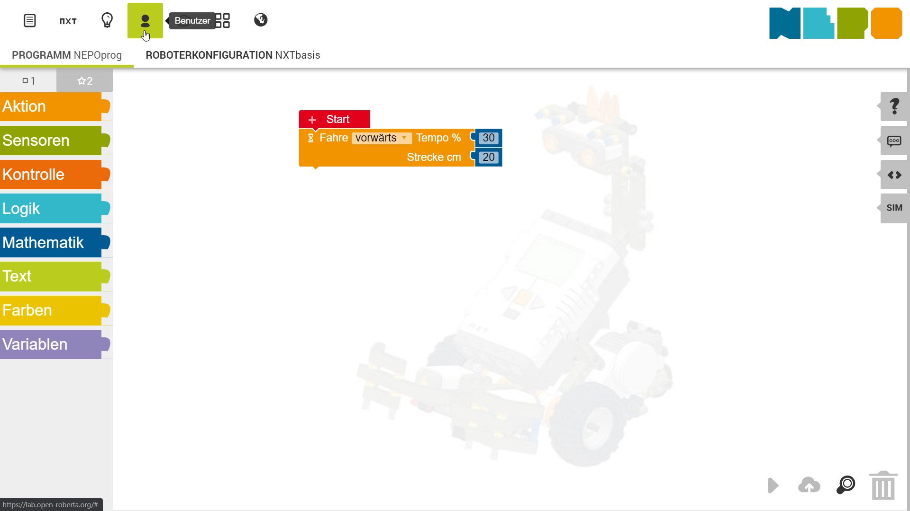
	

</li>

<li> Klicke auf `anmelden ...`.
	

	
Bildschirmaufnahme anzeigen.

		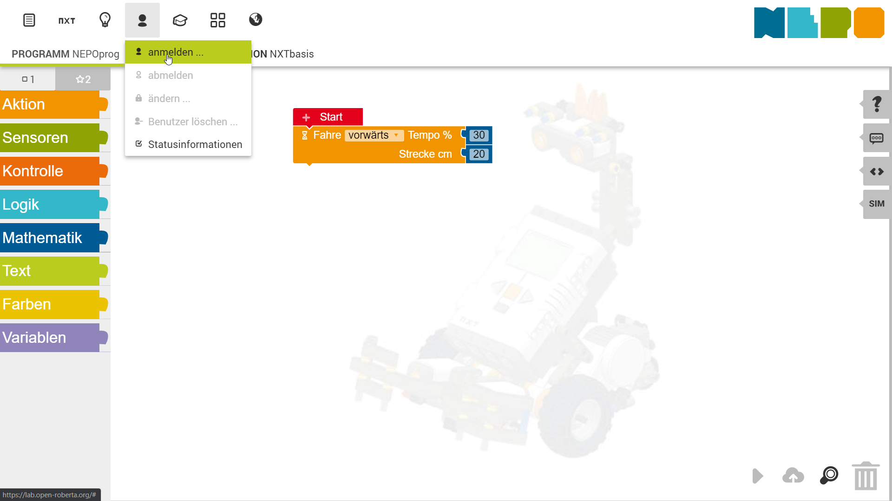
	

</li>

<li> Klicke auf `neu`
	

	
Bildschirmaufnahme anzeigen.

		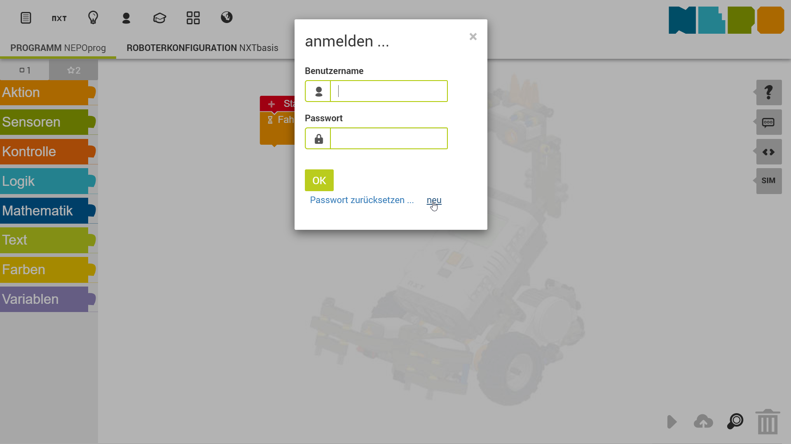
	

</li>

<li> Fülle das Anmelde-Formular aus.
	

	
Bildschirmaufnahme anzeigen.

		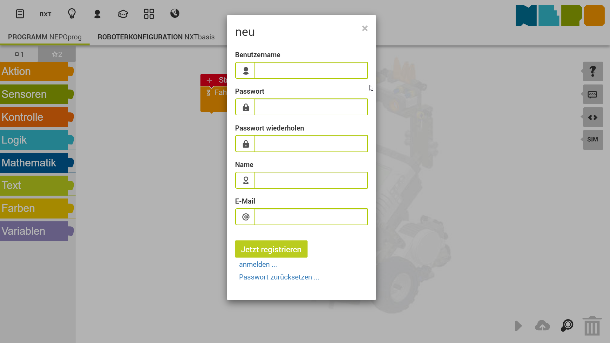
	

</li>

<li> Klicke auf `Jetzt registrieren` </li>
</ol>

i> Die Felder `Name` und `E-Mail` sind **optional**.

## Programm speichern
Hier findest du eine Schritt-für-Schirtt-Anleitung, wie dein Programm speicher kannst.
<ol>
<li> Klicke auf das Bearbeiten-Icon.
	

	
Bildschirmaufnahme anzeigen.

		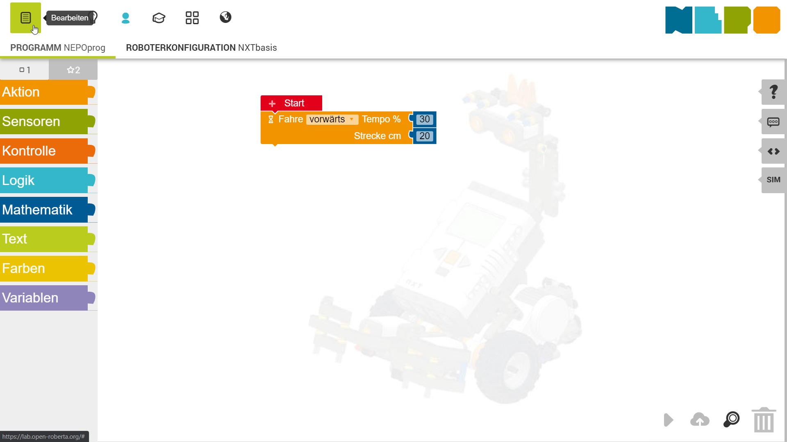
	

</li>

<li> Klicke auf `speichern unter ...`.
	

	
Bildschirmaufnahme anzeigen.

		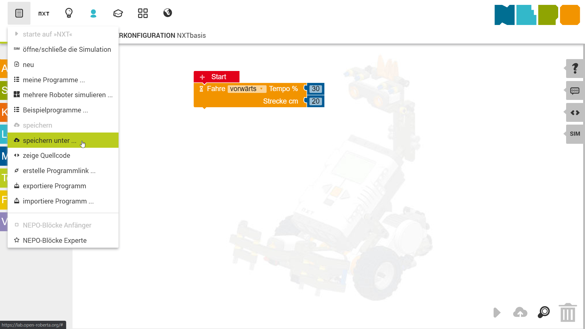
	

</li>

<li> Gib deinem Programm einen Namen.
	

	
Bildschirmaufnahme anzeigen.

		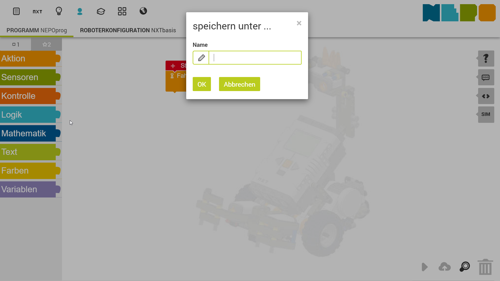
	

</li>

<li> Klicke auf `OK`.
	

	
Bildschirmaufnahme anzeigen.

		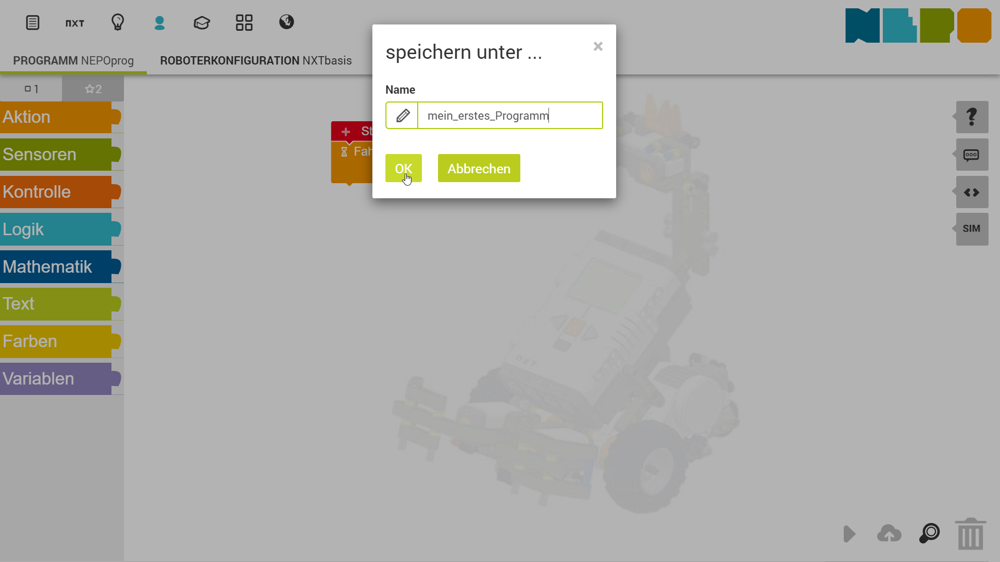
	

</li>
</ol>

## Programm öffnen
Um ein Programm zu öffnen, muss du dich zunächst anmelden.

Danach kannst du ...
<ol>
<li> auf das Bearbeiten-Icon klicken,
	

	
Bildschirmaufnahme anzeigen.

		
	

</li>
<li> auf `meine Programme ...` klicken,
	

	
Bildschirmaufnahme anzeigen.

		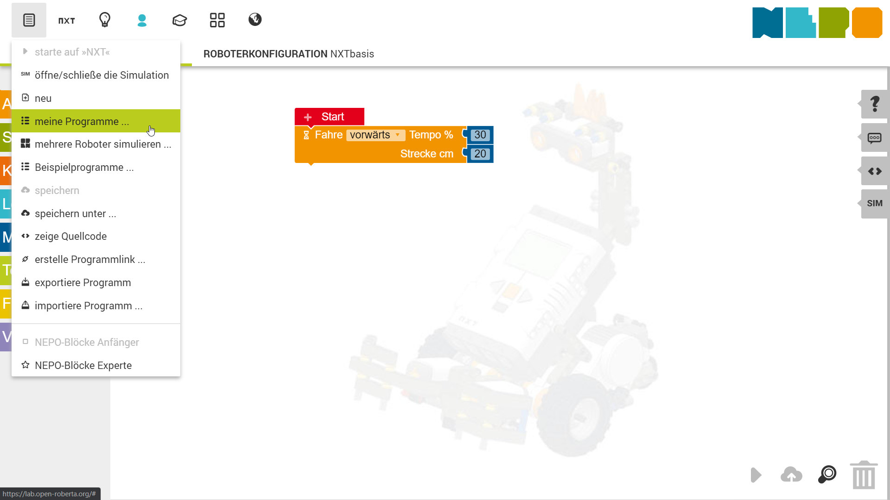
	

</li>
<li> dann das Programm aus der Liste deiner Programmes auswählen und per Maus-Klick öffnen.
	

	
Bildschirmaufnahme anzeigen.

		
	

</li>

</ol>

## Bildschirmaufnahmen

### Auswahl des Systems
Wenn du das Open Roberta Lab startest, musst du zunächst das System auswählen.
Klicke hierzu auf das NXT-Symbol.

i> Zum verschieben der Symbole kannst du die Pfeile auf der linken und rechen Seite verwenden.

### Drag-and-Drop
Hier siehst du, wie du einen Block dein Programm per Drag-and-Drop hinzufügen kannst.
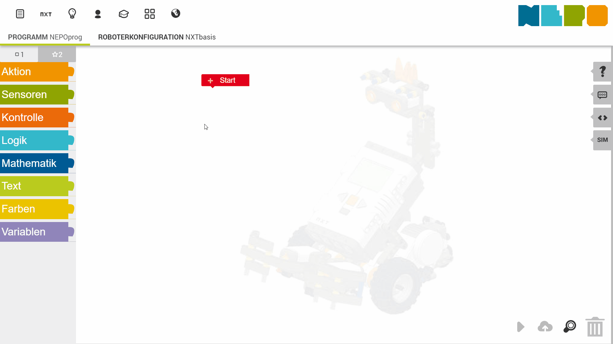

### Simulation
Hier siehst du, wie du
1. den Simulationsbereich öffnest,
2. die Simulationsumgebung wechselst und
3. die Simulation startest.

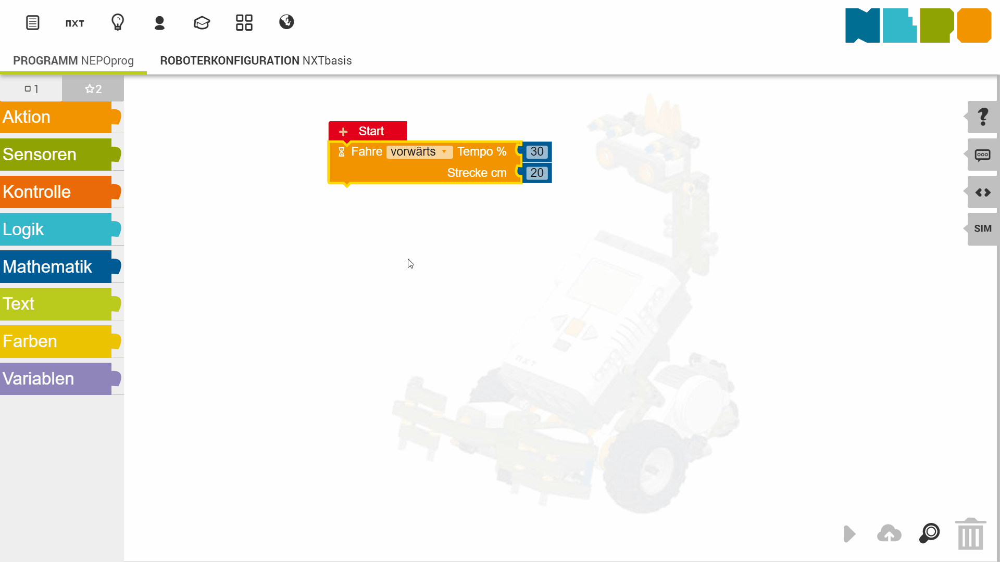

i> Bei der zweiten Simulationsumgebung hinterläst der Roboter eine Spur in der Siumlationsumgebung.
