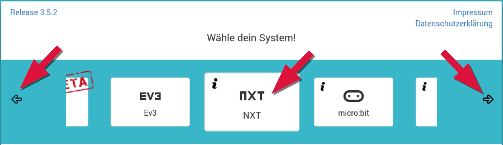
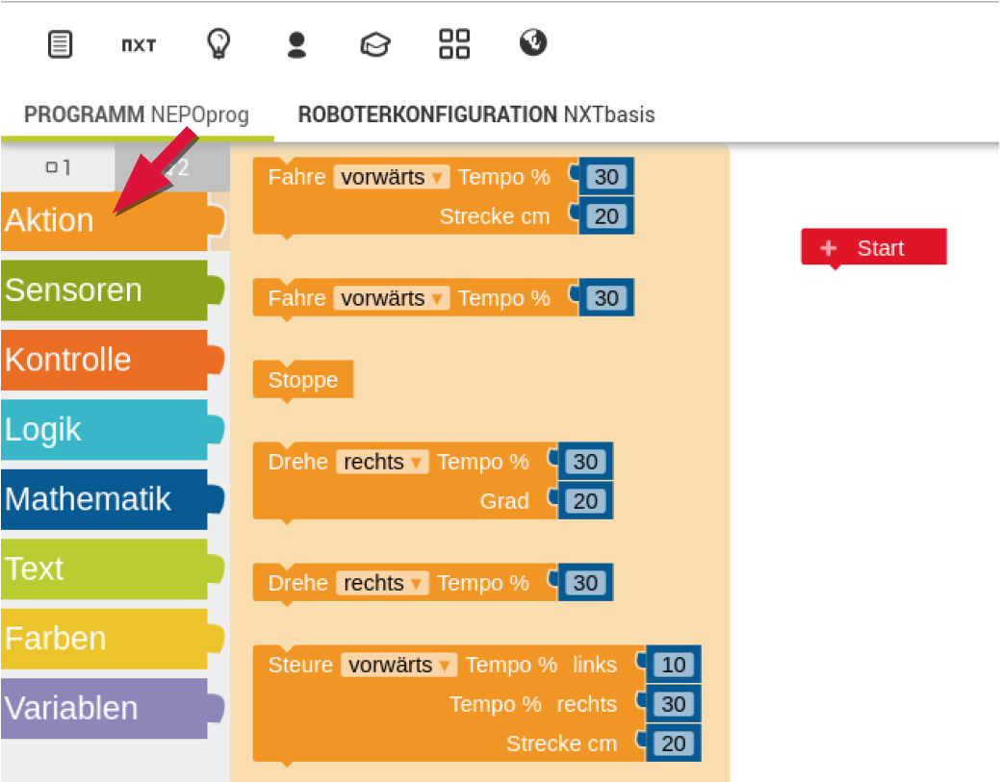

# Einführung in das Open Roberta Lab
Hier findest du eine kurze Einführung in die Programmierung des NXT-Roboters mit dem Open Roberta Lab

# Ziel
t> Programmiere den Roboter so, dass dieser ein Viereck mit der Seitenlänge von 20 cm abfährt.

# Anleitung
* Öffne die Webseite: [https://lab.open-roberta.org/](https://lab.open-roberta.org/)
* Wähle NXT als System aus. Klicke hierzu auf das NXT-Symbol.

i> Zum verschieben der Symbole kannst du die Pfeile auf der linken und rechen Seite verwenden.

* Auf der linken Seite findest du unter „Aktion“ die Aktionsblöcke.
Diese Aktionsblöcke sind Anweisungen, die der NXT-LEGO-Roboter versteht
und ausführen kann. Aus diesen Anweisungen kannst du ein Programm
erstellen, das der Roboter Schritt für Schritt abarbeitet.

i> Für dein Programm benötigst du die Blöcke: 

* Über lege dir wie dir der Block „Wiederhole 10 mal mache …“ weiter helfen
kann. Du findest diesen Block unter der Rubrik „Kontrolle“

# Zusatzaufgabe
t> Lass den Roboter das Haus vom Nikolaus abfahren.
