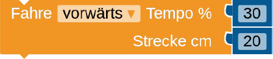

# Einführung in das Open Roberta Lab
Hier findest du eine kurze Einführung in die Programmierung des NXT-Roboters mit dem Open Roberta Lab

**Inhaltsverzeichnis**
<!-- vscode-markdown-toc -->
* [Ziel](#Ziel)
* [Anleitung](#Anleitung)
* [Zusatzaufgabe](#Zusatzaufgabe)
* [Bildschirmaufnahmen](#Bildschirmaufnahmen)
	* [Auswahl des Systems](#AuswahldesSystems)
	* [Drag-and-Drop](#Drag-and-Drop)
	* [Simulation](#Simulation)

<!-- vscode-markdown-toc-config
	numbering=false
	autoSave=true
	/vscode-markdown-toc-config -->
<!-- /vscode-markdown-toc -->

## Ziel
t> Programmiere den Roboter so, dass dieser ein Viereck mit der Seitenlänge von 20 cm abfährt.

## Anleitung
1. Öffne die Webseite: [https://lab.open-roberta.org/](https://lab.open-roberta.org/)
2. [Wähle NXT als System aus.](#AuswahldesSystems) Klicke hierzu auf das NXT-Symbol.

3. Auf der linken Seite findest du unter `Aktion` die Aktionsblöcke.
Diese Aktionsblöcke sind Anweisungen, die der NXT-LEGO-Roboter versteht
und ausführen kann. Aus diesen Anweisungen kannst du ein Programm
erstellen, das der Roboter Schritt für Schritt abarbeitet.
Diese Aktionsblöcke kannst du per [Drag-and-Drop](#Drag-and-Drop) hinzufügen.

4. Über lege dir wie dir der Block `Wiederhole 10 mal mache ...` weiter helfen
kann. Du findest diesen Block unter der Rubrik `Kontrolle`

i> Für dein Programm benötigst du die Blöcke:  
 

i> Wenn du dein Programm testen möchtest, kannst du das in der [Simulation](#Simulation) tun.

## Zusatzaufgabe
t> Lass den Roboter das Haus vom Nikolaus abfahren.

## Bildschirmaufnahmen

### Auswahl des Systems
Wenn du das Open Roberta Lab startest musst du zunächst das System auswählen.
Klicke hierzu auf das NXT-Symbol.

i> Zum verschieben der Symbole kannst du die Pfeile auf der linken und rechen Seite verwenden.

### Drag-and-Drop
Hier siehst du, wie du einen Block dein Programm per Drag-and-Drop hinzufügen kannst.

### Simulation
Hier siehst du, wie du
1. den Simulationsbereich öffnest,
2. die Simulationsumgebung wechselst und
3. die Simulation startest.

i> Bei der zweiten Simulationsumgebung hinterläst der Roboter eine Spur in der Siumlationsumgebung.
